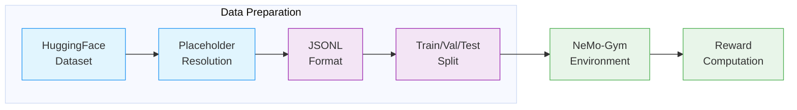
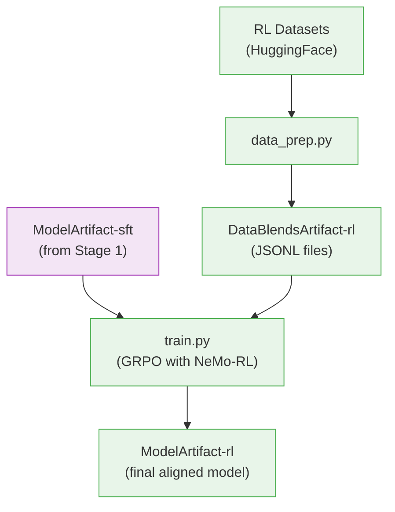

# Stage 2: Reinforcement Learning (RL)

This stage aligns the instruction-tuned model using GRPO (Group Relative Policy Optimization) with [NeMo-RL](../nvidia-stack.md#nemo-rl).

> **Open-Source Data Only**: This recipe uses exclusively open-sourced RL data from the [Nemotron Post-training Datasets](https://huggingface.co/collections/nvidia/nemotron-post-training-v3) collection, which is a subset of the full data used to train the released model. The recipe uses the [Nemotron-3-Nano-RL-Training-Blend](https://huggingface.co/datasets/nvidia/Nemotron-3-Nano-RL-Training-Blend) dataset. Results will differ from the benchmarks in the [tech report](https://research.nvidia.com/labs/nemotron/files/NVIDIA-Nemotron-3-Nano-Technical-Report.pdf). Use this recipe as a reference implementation to apply the methodology with your own data.

---

## Training Methodology

> **Training Framework**: RL alignment is implemented using [NeMo-RL](https://docs.nvidia.com/nemo/rl/latest/) with Ray for distributed actor coordination and vLLM for fast rollout generation. The Megatron backend handles distributed policy training with tensor, pipeline, context, and expert parallelism. See [NeMo-RL Documentation](https://docs.nvidia.com/nemo/rl/latest/) for implementation details.
>
> For complete methodology, see [Tech Report Section 3.2](https://research.nvidia.com/labs/nemotron/files/NVIDIA-Nemotron-3-Nano-Technical-Report.pdf).

### RL Pipeline Overview

The RL pipeline consists of three components:
1. **RLVR** — Multi-environment training with verifiable rewards
2. **RLHF with GenRM** — Generative reward model-based alignment
3. **DPO** — Preference learning to reduce tool hallucination

### Data Preparation Pipeline

Before training, the RL dataset is transformed into JSONL format compatible with NeMo-Gym:



| Stage | What Happens |
|-------|--------------|
| **HuggingFace Dataset** | Load [Nemotron-3-Nano-RL-Training-Blend](https://huggingface.co/datasets/nvidia/Nemotron-3-Nano-RL-Training-Blend) from HuggingFace Hub |
| **Placeholder Resolution** | Resolve `_hf_placeholder` records by fetching from external datasets (DAPO, Skywork) and applying template restoration |
| **JSONL Format** | Convert to JSONL with `question`, `expected_answer`, and `responses_create_params` fields |
| **Train/Val/Test Split** | Split into training (98%), validation (1%), and test (1%) sets |
| **NeMo-Gym Environment** | Route samples to appropriate reward environments based on task type |
| **Reward Computation** | Compute verifiable rewards (math correctness, code execution, schema adherence) |

**Placeholder Resolution:**

The [Nemotron-3-Nano-RL-Training-Blend](https://huggingface.co/datasets/nvidia/Nemotron-3-Nano-RL-Training-Blend) dataset contains placeholder records that reference external HuggingFace datasets. The `data_prep.py` script resolves these by:

1. Detecting placeholder records by the presence of `_hf_placeholder` field
2. Fetching actual data from external HF datasets:
   - [ByteDance-Seed/DAPO-Math-17k](https://huggingface.co/datasets/ByteDance-Seed/DAPO-Math-17k) — Math reasoning problems
   - [Skywork/Skywork-OR1-RL-Data](https://huggingface.co/datasets/Skywork/Skywork-OR1-RL-Data) — Open reasoning data
3. Applying template restoration (DAPO prefix/suffix, Skywork `{question}` replacement)

> For data preparation implementation, see **Recipe Source**: `src/nemotron/recipes/nano3/stage2_rl/data_prep.py`

### GRPO Algorithm

GRPO (Group Relative Policy Optimization) optimizes the policy using group-relative advantages:

1. **Generate responses** from the current policy using vLLM
2. **Evaluate** responses using NeMo-Gym reward environments
3. **Compute group-relative advantages** across response groups per prompt
4. **Update the policy** to favor higher-reward responses with clipped gradients

**Loss Function:**

The GRPO loss uses clipped policy gradients with KL regularization:

$$
L(\theta) = E_{x \sim \pi_{\theta_{\text{old}}}} \Big[ \min \Big(\frac{\pi_\theta(x)}{\pi_{\theta_{\text{old}}}(x)}A_t, \text{clip} \big( \frac{\pi_\theta(x)}{\pi_{\theta_{\text{old}}}(x)}, 1 - \varepsilon, 1 + \varepsilon \big) A_t \Big) \Big] - \beta D_{\text{KL}} (\pi_\theta \| \pi_\text{ref})
$$

Where:
- $\pi_\theta$ is the policy being optimized
- $\pi_{\theta_{\text{old}}}$ is the policy from the beginning of this step
- $A_t$ is the advantage estimate (group-relative)
- $\varepsilon$ is the clipping hyperparameter (0.2–0.28)
- $\beta$ is the KL penalty coefficient
- $\pi_{\text{ref}}$ is the reference policy (frozen SFT checkpoint)

**Stability Improvements:**

| Improvement | Description |
|-------------|-------------|
| **On-Policy KL Approximation** | Uses importance weights to correct for off-policy samples, providing an unbiased and guaranteed-positive KL estimator |
| **Importance Sampling Correction** | Corrects for discrepancies between inference (vLLM) and training (Megatron) token probabilities |
| **Overlong Filtering** | Excludes sequences that hit max length without EOS from loss computation, reducing noise from truncated generations |
| **Asymmetric Clipping** | Uses `ratio_clip_min=0.2` and `ratio_clip_max=0.28` for asymmetric policy update bounds |

> For detailed loss function derivations, see the [NeMo-RL GRPO Guide](https://docs.nvidia.com/nemo/rl/latest/guides/grpo.html#loss).

### Multi-Environment RLVR

Training uses 6 reward environments through NeMo-Gym:

| Environment | Description | Reward Type |
|-------------|-------------|-------------|
| **math_with_judge** | Mathematical reasoning (DAPO, Skywork math) | Answer correctness verification |
| **code_gen** | Code correctness with test case execution | Unit test pass rate |
| **mcqa** | STEM multiple choice questions | Answer matching |
| **instruction_following** | IFEval, Multi-Challenge compliance | Constraint satisfaction |
| **workplace_assistant** | Agentic tool use, multi-turn interactions | Task completion |
| **structured_outputs_json** | JSON schema adherence | Schema validation |

Training on all environments simultaneously provides stable gains without co-reward degradation.

> For environment implementation details, see [NeMo-RL Environments Guide](https://docs.nvidia.com/nemo/rl/latest/guides/environments.html).

### GenRM (RLHF)

Generative reward models use circular comparison strategy (N comparisons instead of O(N²)) with length-normalized reward adjustment:

| Parameter | Value |
|-----------|-------|
| **Prompts per batch** | 128 |
| **Responses per prompt** | 16 |
| **Comparison strategy** | Circular |
| **Length bonus α** | 0.5 |

> For GenRM training details, see [Tech Report Section 3.2](https://research.nvidia.com/labs/nemotron/files/NVIDIA-Nemotron-3-Nano-Technical-Report.pdf).

### DPO for Tool Hallucination

DPO reduces hallucinated tool usage with minimal computational overhead:

| Metric | Before DPO | After DPO |
|--------|------------|-----------|
| **AIME25 Accuracy** | 80.88% | 84.58% |
| **Hallucination Rate** | 8.33% | 0.7% |

> For DPO methodology, see [Tech Report Appendix C](https://research.nvidia.com/labs/nemotron/files/NVIDIA-Nemotron-3-Nano-Technical-Report.pdf) and [NeMo-RL DPO Guide](https://docs.nvidia.com/nemo/rl/latest/guides/dpo.html).

### Reasoning Control

The model supports:
- **Reasoning on/off control** — Strip reasoning from 10% of samples
- **Token budget control** — Truncate 3% of reasoning traces to different budgets

### Hyperparameters

**GRPO Settings:**

| Parameter | Value | Description |
|-----------|-------|-------------|
| `num_prompts_per_step` | 128 | Prompts sampled per training step |
| `num_generations_per_prompt` | 16 | Rollouts generated per prompt |
| `max_total_sequence_length` | 49152 | Maximum sequence length (~49K tokens) |
| `normalize_rewards` | true | Normalize rewards across batch |
| `use_leave_one_out_baseline` | true | Variance reduction for advantage estimation |
| `val_period` | 5 | Validation every N steps |
| `max_num_epochs` | 1 | Single epoch over data |
| `seed` | 42 | Random seed for reproducibility |

**Loss Function:**

| Parameter | Value | Description |
|-----------|-------|-------------|
| `ratio_clip_min` | 0.2 | Lower bound for importance ratio clipping |
| `ratio_clip_max` | 0.28 | Upper bound for importance ratio clipping |
| `use_on_policy_kl_approximation` | true | Use unbiased on-policy KL estimator |
| `use_importance_sampling_correction` | true | Correct for inference/training mismatch |
| `token_level_loss` | true | Per-token loss normalization |
| `reference_policy_kl_penalty` | 0 | KL regularization weight (disabled) |

**Optimizer:**

| Parameter | Value |
|-----------|-------|
| `optimizer` | AdamW |
| `lr` | 3e-6 |
| `min_lr` | 3e-6 |
| `weight_decay` | 0.0 |
| `adam_beta1` | 0.9 |
| `adam_beta2` | 0.999 |
| `adam_eps` | 1e-8 |
| `clip_grad` | 1.0 |

**Sequence Packing:**

| Parameter | Value |
|-----------|-------|
| `enabled` | true |
| `algorithm` | modified_first_fit_decreasing |
| `sequence_length_round` | 64 |

---

## Recipe Execution

### Quick Start

<div class="termy">

```console
// 1. Prepare data (convert to JSONL format)
$ uv run nemotron nano3 data prep rl --run YOUR-CLUSTER

// 2. Run RL training
$ uv run nemotron nano3 rl --run YOUR-CLUSTER
```

</div>

> **Note**: The `--run YOUR-CLUSTER` flag submits jobs via [NeMo-Run](../nemo-run.md). See [Execution through NeMo-Run](../nemo-run.md) for setup.

### Running in NeMo-RL Repository

For direct execution using NeMo-RL (without the nemotron CLI wrapper), follow the [NeMo-RL Nemotron 3 Nano Guide](https://docs.nvidia.com/nemo/rl/latest/guides/nemotron-3-nano.html):

**1. Download and prepare the dataset:**

```bash
# Download the RL blend dataset
huggingface-cli download nvidia/Nemotron-3-Nano-RL-Training-Blend \
    --repo-type dataset \
    --local-dir /path/to/rl-blend

# Fill in placeholder entries (resolves DAPO, Skywork references)
python /path/to/rl-blend/create_nanov3_jsonl.py /path/to/rl-blend/data/train.jsonl

# Split into train/validation
head -n -1000 /path/to/rl-blend/data/train.jsonl > /path/to/train.jsonl
tail -n 1000 /path/to/rl-blend/data/train.jsonl > /path/to/validation.jsonl
```

**2. Run GRPO training:**

```bash
# From NeMo-RL repository root
uv run python examples/nemo_gym/run_grpo_nemo_gym.py \
    --config examples/nemo_gym/grpo_nanov3.yaml \
    data.train_jsonl_fpath=/path/to/train.jsonl \
    data.validation_jsonl_fpath=/path/to/validation.jsonl \
    policy.model_name=/path/to/sft/checkpoint \
    logger.wandb_enabled=True
```

> **Note**: The default recipe requires 32 nodes with 8 GPUs each. See the [NeMo-RL cluster documentation](https://docs.nvidia.com/nemo/rl/latest/cluster.html) for Slurm configuration.

### Configuration

| File | Purpose |
|------|---------|
| `config/default.yaml` | Production GRPO configuration |
| `config/data_prep/default.yaml` | Data preparation settings |
| `config/data_prep/data_blend_raw.json` | RL dataset blend |

### Data Preparation

The `data_prep.py` script converts datasets to JSONL format compatible with [NeMo-RL](../nvidia-stack.md#nemo-rl)'s NeMo-Gym interface. See [Data Preparation Module](../data-prep.md) for detailed documentation.

#### CLI Command

```bash
uv run nemotron nano3 data prep rl [options]
```

| Option | Description |
|--------|-------------|
| `--run <profile>` | Execute on Slurm via [NeMo-Run](../nemo-run.md) |
| `--sample N` | Limit rows per dataset (for testing) |
| `--force` | Force re-run, ignoring cache |

#### Output

```
output/nano3/stage2_rl/
├── train/
│   └── data.jsonl
├── val/
│   └── data.jsonl
├── test/
│   └── data.jsonl
└── manifest.json
```

The output is registered as a [W&B Artifact](../artifacts.md) (`DataBlendsArtifact-rl`) for lineage tracking.

### Training

#### CLI Command

```bash
uv run nemotron nano3 rl [options] [overrides...]
```

| Option | Description |
|--------|-------------|
| `--run <profile>` | Attached—submits and waits, streaming logs ([NeMo-Run](../nemo-run.md)) |
| `--batch <profile>` | Detached—submits and exits immediately ([NeMo-Run](../nemo-run.md)) |
| `--dry-run` | Preview execution plan |
| `key=value` | Override config values ([CLI Framework](../cli.md#dotlist-overrides)) |

#### Override Examples

```bash
# More training steps
uv run nemotron nano3 rl grpo.max_num_steps=200000

# Different temperature for generation
uv run nemotron nano3 rl policy.generation.temperature=0.8

# Different learning rate
uv run nemotron nano3 rl policy.megatron_cfg.optimizer.lr=5e-7

# Disable sequence packing
uv run nemotron nano3 rl policy.sequence_packing.enabled=false
```

### Running with NeMo-Run

Configure execution profiles in `env.toml`:

```toml
[wandb]
project = "nemotron"
entity = "YOUR-TEAM"

[YOUR-CLUSTER]
executor = "slurm"
account = "YOUR-ACCOUNT"
partition = "batch"
nodes = 32
ntasks_per_node = 8
gpus_per_node = 8
mem = "0"
exclusive = true
mounts = ["/lustre:/lustre"]
```

See [Execution through NeMo-Run](../nemo-run.md) for complete configuration options.

### Checkpoint & Resume

Training automatically saves checkpoints based on validation reward. To resume from a checkpoint:

```bash
# Resume from a specific checkpoint
uv run nemotron nano3 rl policy.model_name=/path/to/checkpoint

# Resume from latest checkpoint in results directory
uv run nemotron nano3 rl checkpointing.checkpoint_dir=/path/to/results
```

**Checkpoint Configuration:**

| Option | Value | Description |
|--------|-------|-------------|
| `save_period` | 10 | Steps between checkpoint saves |
| `metric_name` | val:total_reward/mean | Metric for best checkpoint selection |
| `higher_is_better` | true | Higher reward = better checkpoint |
| `keep_top_k` | 1000000 | Number of checkpoints to retain |

### Troubleshooting

Common errors and solutions:

| Error | Cause | Solution |
|-------|-------|----------|
| High `token_mult_prob_error` | Mismatch between vLLM and Megatron probabilities | Check weight refitting; ensure vLLM compilation settings match |
| KL divergence spikes | Single token probability errors in MoE | Monitor `gen_kl_error` metric; values above 1e-3 indicate issues |
| OOM during generation | vLLM memory allocation too high | Reduce `gpu_memory_utilization` (default 0.5) |
| Slow convergence | Learning rate too low or high | Adjust `policy.megatron_cfg.optimizer.lr` |

**Debugging tips:**

- Monitor `token_mult_prob_error` for inference/training consistency (should stay below ~2%)
- Watch `sampling_importance_ratio` (should hover around 1.0)
- Check `approx_entropy` for entropy collapse during training
- Use `--sample N` in data prep for quick iteration

---

## Artifact Lineage



---

## Infrastructure

This stage uses the following components from the [NVIDIA AI Stack](../nvidia-stack.md):

| Component | Role | Documentation |
|-----------|------|---------------|
| [NeMo-RL](../nvidia-stack.md#nemo-rl) | GRPO algorithm, policy training, reward computation | [Docs](https://docs.nvidia.com/nemo/rl/latest/) |
| [Megatron-Core](../nvidia-stack.md#megatron-core) | Distributed training primitives (TP, PP, CP, EP) | [GitHub](https://github.com/NVIDIA/Megatron-LM) |
| [Ray](https://ray.io/) | Distributed actor coordination | [Docs](https://docs.ray.io/) |
| vLLM | Fast rollout generation | [GitHub](https://github.com/vllm-project/vllm) |

### Parallelism Configuration

Training uses multiple parallelism strategies for efficient scaling:

| Parallelism | Value | Config Key |
|-------------|-------|------------|
| Tensor (TP) | 2 | `policy.megatron_cfg.tensor_model_parallel_size` |
| Pipeline (PP) | 2 | `policy.megatron_cfg.pipeline_model_parallel_size` |
| Context (CP) | 4 | `policy.megatron_cfg.context_parallel_size` |
| Expert (EP) | 8 | `policy.megatron_cfg.expert_model_parallel_size` |
| Sequence (SP) | Yes | `policy.megatron_cfg.sequence_parallel` |

**Generation (vLLM):**

| Parameter | Value | Description |
|-----------|-------|-------------|
| `tensor_parallel_size` | 4 | TP for vLLM generation |
| `gpu_memory_utilization` | 0.5 | GPU memory fraction for KV cache |
| `colocated` | true | Share GPUs with training |
| `enforce_eager` | false | Use torch.compile |

**Cluster:**

| Parameter | Value |
|-----------|-------|
| `num_nodes` | 32 |
| `gpus_per_node` | 8 |

### Key Features Used

| Feature | Purpose |
|---------|---------|
| GRPO algorithm | Group Relative Policy Optimization with clipped gradients |
| Megatron backend | Distributed training with TP/PP/CP/EP parallelism |
| Sequence Packing | Efficient batch utilization for variable-length generations |
| vLLM Generation | Fast rollout with tensor parallelism |
| MoE Router Bias | Aux-loss-free load balancing (`freeze_moe_router=true`) |
| Per-token Loss | Consistent gradient signal (`calculate_per_token_loss=true`) |

### NeMo-Gym Environments

The training configuration includes these reward environment configs:

```yaml
env:
  nemo_gym:
    config_paths:
      - responses_api_models/vllm_model/configs/vllm_model_for_training.yaml
      - resources_servers/math_with_judge/configs/math_with_judge.yaml
      - resources_servers/code_gen/configs/code_gen.yaml
      - resources_servers/workplace_assistant/configs/workplace_assistant.yaml
      - resources_servers/mcqa/configs/mcqa.yaml
      - resources_servers/instruction_following/configs/instruction_following.yaml
      - resources_servers/structured_outputs/configs/structured_outputs_json.yaml
```

### Architecture

NeMo-RL uses a Ray-based actor model:

| Actor | Function |
|-------|----------|
| **Policy Model** | Trainable policy weights (Megatron backend) |
| **Generator** | vLLM-backed rollout generation (colocated) |
| **Reward Environments** | NeMo-Gym environments for reward computation |
| **Reference Model** | Frozen SFT checkpoint for KL divergence |

### Container

```
nvcr.io/nvidia/nemo-rl:v0.4.0.nemotron_3_nano
```

---

## Next Steps

After RL completes, the final aligned model (`ModelArtifact-rl`) is ready for evaluation and deployment.

## Reference

- [Tech Report Section 3.2](https://research.nvidia.com/labs/nemotron/files/NVIDIA-Nemotron-3-Nano-Technical-Report.pdf) — RL methodology
- [NeMo-RL Documentation](https://docs.nvidia.com/nemo/rl/latest/) — GRPO, DPO, environments
- [NeMo-RL Nemotron 3 Nano Guide](https://docs.nvidia.com/nemo/rl/latest/guides/nemotron-3-nano.html) — Upstream training guide
- [NVIDIA AI Stack](../nvidia-stack.md) — NeMo-RL, Megatron-Core documentation
- [Artifact Lineage](../artifacts.md) — W&B artifact system
- [Stage 0: Pretraining](./pretrain.md) — Pretrain the base model
- [Stage 1: SFT](./sft.md) — Instruction tuning
- **Recipe Source**: `src/nemotron/recipes/nano3/stage2_rl/` — Implementation details
- [Back to Overview](./README.md)
